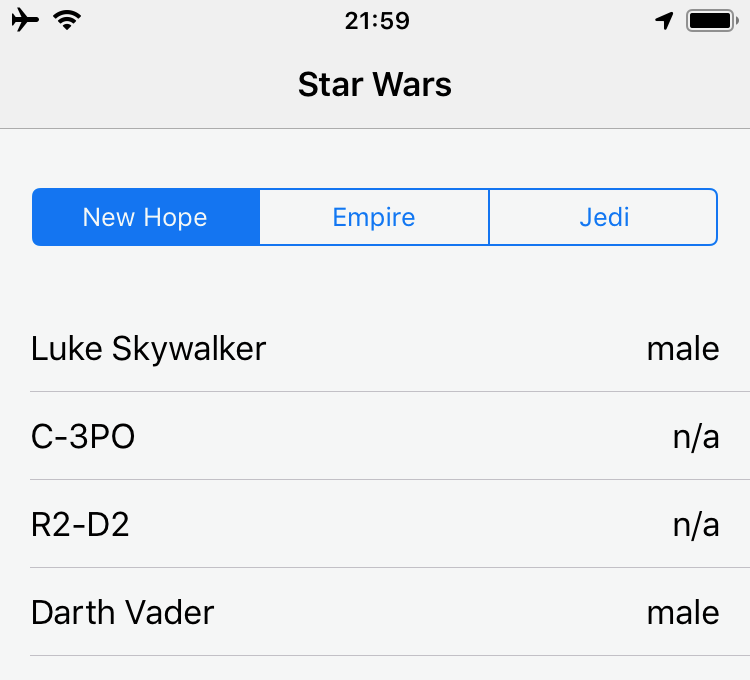

#  API Prototype

## The Star Wars API

Test App to download and parse JSON from an API and display inside a tableView in the App. Additionally added the ability to filter from 3 of the films. The Star Wars API returns the payload in paged format with 10 records being returned at one time. I there needed repeated calls to ensure all characters were brought into the list. Also wanted to display an indicator to show network activity was in progress so that on a slow connection there would be a visual prompt that the list was not complete.

Calls were asynchronous to ensure that the UI did not lock up while subsequent data was requested. (page 2, page 3 etc)

### Skills
- API / JSON
- Codable
- DispatchQueue (GCD)

